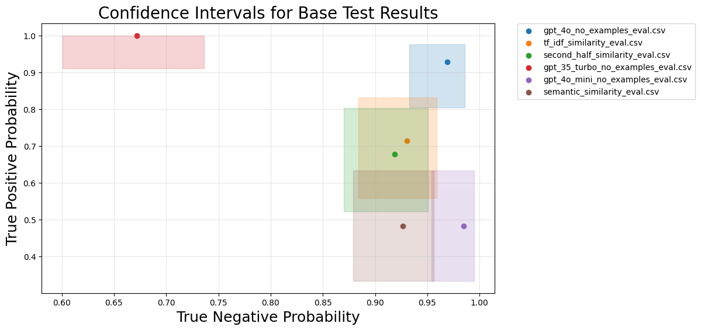

# CocoaER: Entity Resolution Benchmark using Cocoa Supply Chain Data 🌴

*Entity resolution*, i.e. disambiguating data that refers to the same entity and originates from multiple sources, is challenging because of inconsistencies in the way the entity is represented across sources. Cocoa supply chain data exemplifies this problem, as names and abbreviations of cocoa cooperatives often vary across company and government records, rendering it difficult to merge large datasets automatically. We investigate the efficacy of weakly supervised language models in performing entity resolution across two distinct cocoa cooperative datasets: one from the Ivory Coast government's registry of coops, the other compiled from multiple importers. To this end, we introduce a hand-annotated benchmark containing pairs of entries from these two datasets labeled with 0 for different and 1 for same. Using our benchmark dataset we measured the precision, recall, and accuracy for 7 entity resolution methods. We find that GPT-4o performs the best with a 0.96 accuracy, while earlier models are significantly less accurate. This paper makes three key contributions: (1) we evaluate whether popular LLMs are ready for real-life entity disambiguation tasks, (2) we introduce a real-world benchmark for applied entity resolution, and (3) we offer the first non-deterministic method for entity resolution in cocoa supply chain research. 

## Results Overview


The figure shows the accuracy of the six base models. Confidence intervals (computed using Wilson’s method Wilson (1927)) are represented as rectangles around each result. The chart highlights the variability and reliability of each model’s performance. As you can see GPT 4o performed the best overall with a relatively tight confidence interval. 

## Quickstart 🚀

Once you have cloned the repo and created your virtual environment (call it `env`) run:

For Linux/Mac:
```
source env/bin/activate
```
For Windows:
```
env\Scripts\activate
``` 
Install the required dependencies.
```
pip install -r requirements.txt
```
If you have any trouble installing torch at this point please remove the following from requirements.txt: 
```
torch==2.6.0.dev20241204
torchaudio==2.5.0.dev20241205
torchvision==0.20.0.dev20241205
```
Next, install pytorch manually from [their website](https://pytorch.org/get-started/locally/). Lastly, re-run: 
```
pip install -r requirements.txt
```

Add `.env` file to your repo.
```
touch .env
```
Add your `OPENAI_API_KEY` to `.env`. Example:
```
OPENAI_API_KEY=...
```
Finally, you can manually install the data to `./data` from [this google drive link](https://drive.google.com/drive/folders/1EdD6FX5vvtcWez4bVDMbCxhvQZdYTAKA?usp=sharing).

`./data` must look like this before you run any code:

```
/data
├── clean
├── eval
│   └── hand_annotated_pairs.csv
├── outputs
├── raw
│   ├── cocoa-suppliers-compiled-from-importers.csv
│   └── ivorian-cocoa-coop-registry-2017.csv
├── test-results
```

If you do not have the any of the directories listed above inside of `data` add them now.

These are the minimum files/folders. Everything else can be generated. 

## Generate Data 🔢
If you want to regenerate the evaluation template from raw, run the following scripts in order or run `bash build.sh` (if it takes too long to run edit the number of samples in step 3 inside `build.sh`):

Clean the raw data.
```
python clean_raw_data.py
```
Generate pairs using a cartesian product on the clean data.
```
python create_pairs.py
```
Calculate TF-IDF similarity, semantic similarity, and second-half similarity scores to enhance the evaluation template.
```
python semantic_similarity.py 250_000
```
Note: if you want the this semantic similarity step to run faster decrease the number of samples. 

Create the evaluation template.
```
python create_eval_template.py
```
From here you can try to hand annotate the evaluation template or download `hand_annotated_pairs.csv` from the drive folder before generating the evaluaion data using:
```
python evaluate.py
```


## File Descriptions 📂
`clean_raw_data.py`: contains all logic to clean raw data. Run from command line to generate clean data.

`create_pairs.py`: generates the dataset of all possible row pairs between the govenrnment data and the company data. 

`semantic_similarity.py`: contains all the similarity logic (e.g. semantic similarity and tf-idf similarity). When run from command line this file generates all of the pair similairty data needed to create the eval template. 

`create_eval_template.py`: generates the template for the evaluation data when run in command line.

`evaluate.py`: contains logic for evaluating models; outputs results to CSV files when called from command line.

`vis.py`: contains functions used for visualizing information about the data and exploring results.


